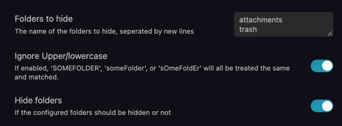

# obsidian-hide-folders (fork)

A fork of [JonasDoesThings/obsidian-hide-folders](https://github.com/JonasDoesThings/obsidian-hide-folders) — a plugin for [obsidian.md](https://obsidian.md) that hides configured folders, with the ability to toggle their visibility.

## What's different in this fork?

### Hide empty folders
A new setting that automatically hides any folder that contains no files. Folders reappear as soon as files are added to them.

This is useful for folders like "Inbox" that are usually empty and just clutter the file tree — they stay hidden until there's actually something in them.

- **10-second grace period** — when a folder becomes empty (e.g. you delete the last file), it stays visible for 10 seconds so you have time to add new files before it disappears.
- **Explicit hide list takes priority** — folders in the "Folders to hide" list are always hidden regardless of whether they have content.
- **Recursive check** — a folder containing only empty subfolders is still considered empty.

## Installation
This fork is not available in the Obsidian community plugin directory. To install, download `main.js` and `manifest.json` from the [latest release](https://github.com/titandrive/obsidian-hide-folders/releases) and copy them to your vault at `VaultFolder/.obsidian/plugins/hide-folders/`.

## Configuration
Enter the list of folder names to hide in the settings menu, **one folder per line**.
You can match folders using three ways:
* Exact folder-names (for example `attachments`)
* All folders **starting with** a specific string (for example `startsWith::_` to filter out all folders whose name starting with a `_`)
* All folders **ending with** a specific string (for example `endsWith::_trash` to filter out all folders whose name is ending with `_trash`)

You can then also use a sidebar button to quickly toggle the visibility without having to enter the settings menu:

Using the command palette is also supported:

## Development
### Setup
- Clone this repo.
- `npm i` or `yarn` to install dependencies
- `npm run dev` to start compilation in watch mode.

### Building
- `npm run build` to do a one-off build of the project, which produces the files needed for manually installing the plugin.

### Manually installing the plugin
- Copy over the outputted `main.js`, `manifest.json` from the `dist/` folder to your vault `VaultFolder/.obsidian/plugins/obsidian-hide-folders/`.
-> Watch Out! You cannot copy-over the raw *main.**ts***. You need to run a build first and then copy over the produced *main.**js***.

## License
MIT License, see [LICENSE.md](./LICENSE.md)
