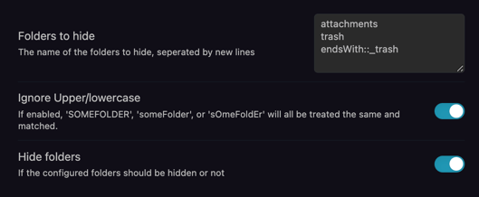

# obsidian-hide-folders

A simple plugin for [obsidian.md](https://obsidian.md) that hides configured folders, with the ability to toggle their visibility.  
This can be used for hiding attachments folders when you don't need them.

## Configuration
Enter the list of folder names to hide in the settings menu, **one folder per line**.

  

## Development
### Setup
- Clone this repo.
- `npm i` or `yarn` to install dependencies
- `npm run dev` to start compilation in watch mode.

### Building
- `npm run build` to do a one-off build of the project, which produces the files needed for manually installing the plugin.

### Manually installing the plugin
- Copy over `main.js`, `styles.css`, `manifest.json` to your vault `VaultFolder/.obsidian/plugins/your-plugin-id/`.  
-> Watch Out! You cannot copy-over the raw *main.**ts***. You need to run a build first and then copy over the produced *main.**js***.

## License
MIT License, see [LICENSE.md](./LICENSE.md)
